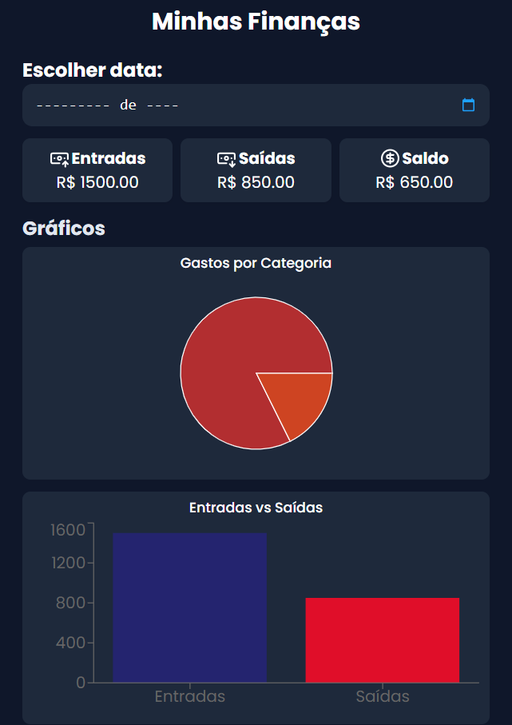
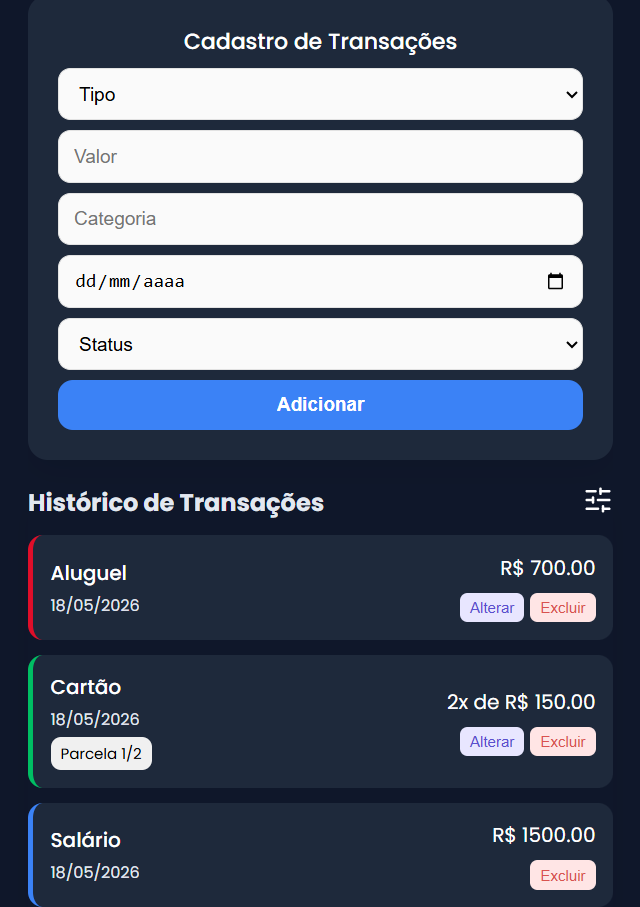

# 💰 Finance Manager

Sistema financeiro web desenvolvido para auxiliar no controle de entradas e saídas financeiras, oferecendo uma visão clara do fluxo de dinheiro através de histórico de transações, filtros inteligentes e gráficos de acompanhamento.

O projeto foi criado com foco em **organização financeira, experiência do usuário e visualização de dados**, permitindo gerenciar movimentações de maneira simples, rápida e intuitiva.

**Tipo de projeto:** Sistema financeiro full stack desenvolvido para gerenciamento pessoal e controle de gastos.

<div align="center">
  
  
</div>

---

## 🎯 Proposta do Projeto

Criar uma aplicação moderna de controle financeiro que permita:

- Registrar entradas e saídas financeiras;
- Visualizar saldo total automaticamente;
- Acompanhar gastos através de gráficos;
- Filtrar transações por mês e status;
- Organizar pagamentos parcelados;
- Facilitar o gerenciamento financeiro pessoal.

---

## ✨ Principais Destaques

- Sistema full stack com Front-End + Back-End;
- Integração com banco de dados Supabase;
- Interface responsiva e intuitiva;
- Filtros inteligentes para histórico financeiro;
- Suporte a transações parceladas;
- Atualização dinâmica de saldo e gráficos;
- Estrutura modular e escalável com React e TypeScript;
- API REST utilizando Fastify.

---

## 📌 Funcionalidades

### Cadastro e Controle de Transações

- Adição de transações do tipo:
  - Entrada;
  - Saída.

- Registro de:
  - Valor;
  - Categoria;
  - Data;
  - Status.

- Validação de campos obrigatórios antes do envio.
- Entradas possuem status fixo:
  - `entrada`

- Saídas permitem:
  - `pago`
  - `pendente`

- Alteração dinâmica de status diretamente no histórico.

### Sistema de Parcelamento

- Possibilidade de marcar saídas como parceladas;
- Campos dinâmicos para quantidade de parcelas e parcela atual;
- Exibição automática de opções conforme o número de parcelas informado;
- Exemplos:
  - `1/2`
  - `2/2`
  - `3/10`

### Dashboard e Visualização Financeira

- Exibição automática de:
  - Total de entradas;
  - Total de saídas;
  - Saldo total.

- Atualização em tempo real após novas transações;
- Gráfico de gastos por saídas;
- Comparativo entre entradas e saídas;
- Visualização simplificada do fluxo financeiro.

### Histórico e Filtros

- Listagem completa das movimentações;
- Remoção de transações;
- Atualização automática da interface;
- Filtro por mês específico ou visualização geral;
- Filtro por status:
  - Entradas;
  - Pagas;
  - Pendentes;
  - Todas juntas.

---

## 🛠️ Tecnologias Utilizadas

### 🎨 Front-End

- **React.js** — construção da interface e componentes;
- **TypeScript** — tipagem estática e maior segurança no desenvolvimento;
- **CSS3** — estilização e responsividade da aplicação;
- **Vite** — ambiente de desenvolvimento rápido e otimizado;
- **Recharts** — criação dos gráficos financeiros;
- **Lucide React** — utilização de ícones na interface.

### ⚙️ Back-End

- **Node.js** — ambiente de execução do servidor;
- **Fastify** — criação da API REST com alta performance;
- **Supabase** — banco de dados PostgreSQL e integração com os dados;
- **@Fastify/CORS** — configuração de permissões entre front-end e back-end;
- **dotenv** — gerenciamento de variáveis de ambiente;
- **TypeScript** — tipagem estática e maior segurança no desenvolvimento.

---

## 🧠 Organização do Código

Estrutura de pastas e arquivos do projeto:

```text
📁 finance-manager
├─ 📁 back-end
│  ├─ 📁 src
│  │  ├─ 📁 lib                    # Configurações e conexões externas
│  │  │  └─ supabase.ts            # Instância e conexão com Supabase
│  │  │
│  │  └─ server.ts                 # Servidor Fastify e rotas da API
│  │
│  ├─ 📄 .env                      # Variáveis de ambiente do back-end
│
├─ 📁 front-end
│  ├─ 📁 src
│  │  ├─ 📁 components             # Componentes reutilizáveis da interface
│  │  ├─ 📁 hooks                  # Hooks customizados e regras de negócio
│  │  ├─ 📁 services               # Comunicação com API e serviços externos
│  │  ├─ 📁 types                  # Tipagens e interfaces TypeScript
│  │  │
│  │  ├─ 📄 App.tsx                # Componente principal da aplicação
│  │  ├─ 📄 main.tsx               # Ponto de entrada do React
│  │  ├─ 📄 App.css                # Estilos principais da aplicação
│  │  └─ 📄 index.css              # Estilos globais
│  │
│  ├─ 📄 .env                      # Variáveis de ambiente do front-end
│  └─ 📄 index.html                # Estrutura HTML principal
```

---

## 🛠️ Como Rodar o Projeto Localmente

### 1. Clone o repositório

```bash
git clone https://github.com/islaianeribeiro/finance-manager.git
```

---

### 2. Acesse a pasta do projeto

```bash
cd finance-manager
```

---

### 3. Instale todas as dependências

```bash
npm install
```

---

### 4. Configure as variáveis de ambiente

Antes de executar o projeto, é necessário configurar os arquivos `.env` do front-end e back-end.

---

#### Back-End

Dentro da pasta:

```text
back-end/
```

Crie um arquivo:

```text
.env
```

E adicione:

```env
SUPABASE_URL=SUA_URL_DO_SUPABASE
SUPABASE_SERVICE_ROLE_KEY=SUA_CHAVE_DO_SUPABASE
PORT=3333
```

---

#### ⚠️ Importante

As variáveis do Supabase podem ser encontradas em:

```text
Supabase → Project Settings → API
```

Onde você terá acesso a:

- `Project URL`
- `service_role key`

---

#### Front-End

Dentro da pasta:

```text
front-end/
```

Crie um arquivo:

```text
.env
```

E adicione:

```env
VITE_API_URL=http://localhost:3333
```

> Essa variável representa a URL da API/back-end utilizada pelo front-end.

---

### 5. Execute o projeto

Inicie front-end e back-end simultaneamente:

```bash
npm run dev
```

---

### 6. Abra no navegador

Acesse o endereço exibido no terminal:

```text
http://localhost:5173
```

---

## 🔧 Possíveis Evoluções

- [ ] Sistema de autenticação;
- [ ] Controle financeiro multiusuário;
- [ ] Metas financeiras;
- [ ] Exportação de relatórios;
- [ ] Tema claro/escuro;
- [ ] Dashboard com métricas avançadas;
- [ ] Notificações de pagamentos pendentes.

---

## 🧠 Aprendizados

Este projeto reforça na prática:

- Desenvolvimento full stack;
- Integração entre Front-End e Back-End;
- Consumo e criação de APIs REST;
- Organização de projetos escaláveis;
- Manipulação de estados complexos;
- Validação de formulários;
- Integração com banco de dados;
- Estruturação de lógica financeira.

---

## 💼 Aplicação no Mercado

Este tipo de sistema pode ser utilizado por:

- Pessoas que desejam organizar finanças pessoais;
- Pequenos negócios;
- Profissionais autônomos;
- Freelancers;
- Microempreendedores.

Como uma solução simples e eficiente para controle financeiro diário.

---

## 👩‍💻 Desenvolvido por

**Islaiane Ribeiro**
Desenvolvedora Front-End

🔗 LinkedIn: [https://www.linkedin.com/in/islaianeribeiro](https://www.linkedin.com/in/islaianeribeiro)

---

## 📄 Licença

Este projeto está sob a licença MIT.
